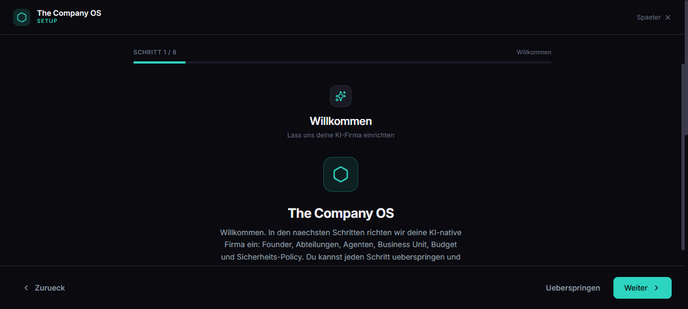
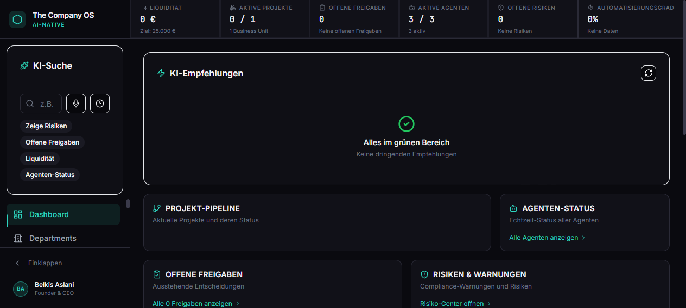
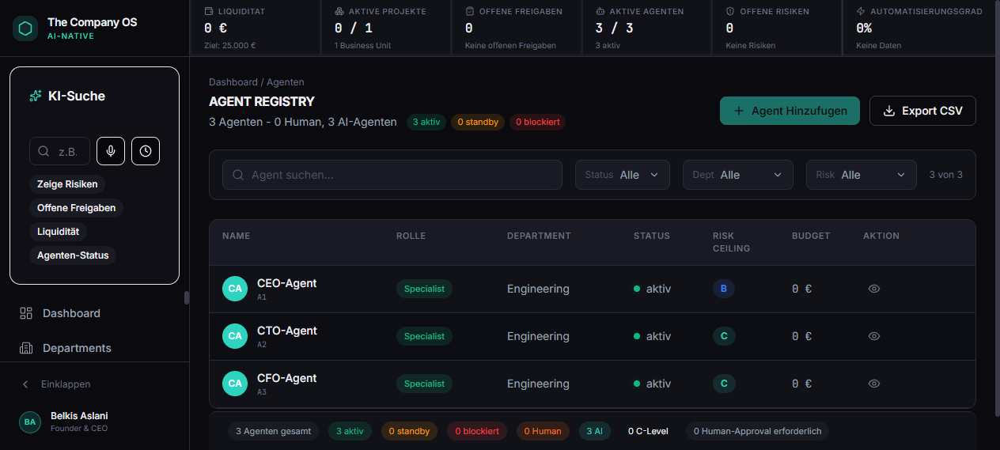
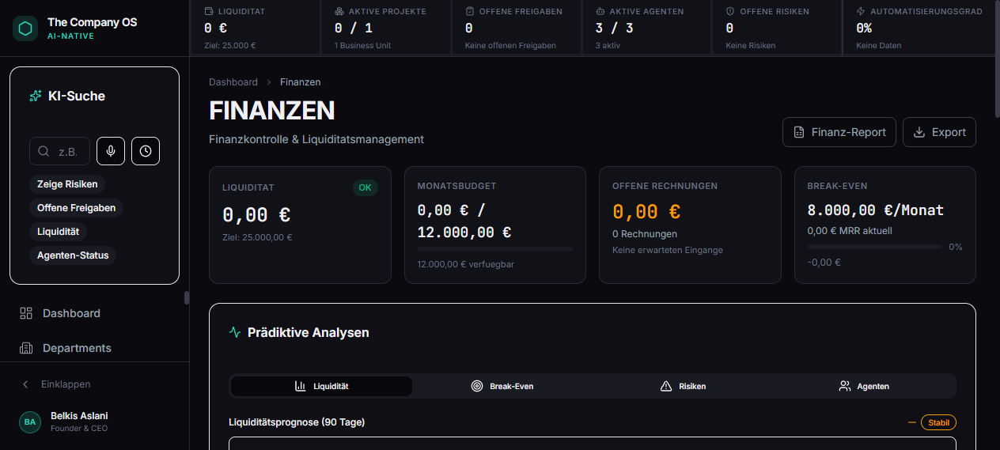
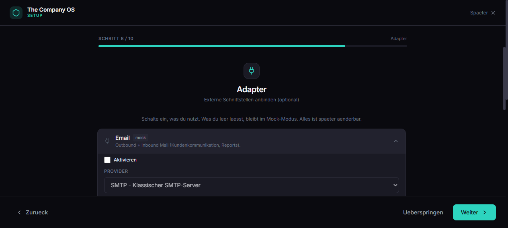
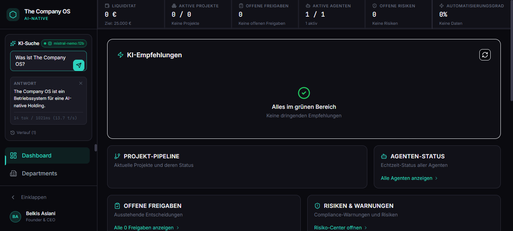

# The Company OS

<p align="center">
  <a href="LICENSE"></a>
  <a href="https://github.com/BEKO2210/The_Company_OS/actions/workflows/ci.yml"></a>
  <a href="https://github.com/BEKO2210/The_Company_OS/actions/workflows/codeql.yml"></a>
  
  
  
  
</p>

> **Status:** Alpha (v0.1.0)
> **Letzte Aktualisierung:** 2026-05-16

## Was ist das Projekt?

**The Company OS** ist das Betriebssystem fuer **"The Company"** — eine AI-native digitale Holding nach deutschem Recht (UG/GmbH). Das System ermoeglicht einem Solo-Gruender, eine vollstaendige Firma mit autonomen Agenten zu betreiben: Planung, Entwicklung, Vertrieb, Support, Qualitaetssicherung, Finanzen und Governance — alles ueber ein zentrales Kontrollzentrum.

## Live Demo
### Alle Fehler (UI/UX sind in der aktuellen Version behoben)

🔗 **Dashboard:** [https://56r72ulnxurem.kimi.page](https://56r72ulnxurem.kimi.page)

## Screenshots

<div align="center">

### First-Run Setup Wizard


<br />

### Dashboard mit eingerichteter Firma


<br />

### Agent Registry


<br />

### Finance


<br />

### Adapter-Konfiguration im Wizard


<br />

### KI-Suche mit lokalem Ollama (mistral-nemo:12b live)


</div>

## Was ist implementiert?

### Dashboard (13 Screens) - alle als **Empty Template** ausgeliefert

Seit Commit `cb345b4` ist `src/data/mockData.ts` leer (`[]`). Jede Seite rendert eine saubere Empty-State, der **Setup-Wizard** fuellt sie:

| Screen | Quelle der Daten | Beschreibung |
|--------|------------------|--------------|
| Company Overview | `CompanyContext` (Wizard) | 6 KPIs, Projekt-Pipeline, Agenten-Status, AI-Insights |
| Departments | derived aus `config.departments` | Karten mit Status, Agenten, Aufgaben |
| Agent Registry | derived aus `config.agents` | Tabelle mit Filter + Detail-Drawer |
| Business Units | derived aus `config.businessUnit` | KPIs, Risiken, Detail-Drawer |
| Product Studios | (noch leer / `[]`) | Empty-State + "Neues Studio" CTA |
| Approval Queue | (noch leer / `[]`) | KPIs Total/RedLine/HighRisk/Approved alle 0 |
| Audit Log | (noch leer / `[]`) | Append-only Ledger, Hash-Chain |
| Risk Center | (noch leer / `[]`) | 5x5 Matrix, Gesamtscore 0/100 |
| Finance | `config.budget` (Wizard) | Liquiditats-Ziel, Monatsbudget, Break-Even-Target |
| Human Workforce | (noch leer / `[]`) | Freelancer/Vendors/Experten, alle 0 |
| Workflows | (noch leer / `[]`) | Empty-State + "Neuer Workflow" |
| Settings | `systemSettings` (leer) + Wizard-Reset-Button | Model Policies, Tool Permissions, RBAC |
| Kill Switch | armed (Default) | 4-Stufen-Notabschaltung |

### Setup-Wizard (10 Schritte)

Willkommen → Firma & Founder → Abteilungen → Agenten → Business Unit → Budget → **Datenbank** (SQLite-Pfad) → **Adapter** (9 Integrationen, siehe unten) → Kill-Switch → **Fertig** (POST `/api/setup/save-env` → schreibt `server/.env` + lockt sich).

### Daten & Modelle
- 15 TypeScript Interfaces in `src/data/models.ts` (Agent, Department, BusinessUnit, ProductStudio, Approval, AuditLogEntry, Risk, Workflow, HumanExpert, FinanceEntry, Invoice, Budget, Incident, SystemSettings, WorkflowStep)
- `src/lib/storage.ts` → typed `CompanyConfig` + localStorage Wrapper
- `src/lib/companyAdapter.ts` → `deriveAgents` / `deriveDepartments` / `deriveBusinessUnits` / `deriveFinance`
- `src/lib/envSerializer.ts` → `CompanyConfig` → `.env` body
- `src/lib/adapterSpecs.ts` → Single source of truth fuer Wizard-UI **und** .env-Writer

### Technologie
- Vite 7 + React 19 + TypeScript 5.9 (strict)
- Tailwind CSS 3.4 mit eigenem Dark-Token-System (`tailwind.config.js`)
- 50+ shadcn/ui Komponenten (Radix-basiert)
- Framer Motion 12, Recharts 2.15, lucide-react
- React Router 7 (HashRouter — `#/route`)
- Express 4 + better-sqlite3 + zod + JWT + bcrypt (Backend)
- Jest + supertest (server tests)
- Ollama-Adapter mit Streaming SSE (`server/src/adapters/ollamaAdapter.ts`)

## Was ist Mock / Adapter?

Default ist **alles Mock**. Jeder Adapter unter `server/src/adapters/` erbt von `BaseAdapter` und schaltet automatisch in den Mock-Modus, solange `MOCK_MODE=true` (Default) und keine Credentials gesetzt sind.

Im **First-Run Setup-Wizard** koennen pro Adapter Provider + Credentials hinterlegt werden. Der Wizard schreibt das Ergebnis via `POST /api/setup/save-env` direkt in `server/.env` (mit Backup `.env.bak`), setzt `MOCK_MODE=false` sobald mindestens ein Adapter aktiv ist und sperrt den Endpoint anschliessend (`SETUP_COMPLETED=true`). Ist das Backend zur Setup-Zeit offline, zeigt der Wizard stattdessen ein Copy-Snippet, das manuell in `server/.env` eingefuegt werden kann.

| Adapter | Default | Provider-Optionen im Wizard |
|---------|---------|------------------------------|
| EmailAdapter              | 🔶 Mock | SMTP / SendGrid / Mailgun |
| LinkedInAdapter           | 🔶 Mock | LinkedIn API / Proxycurl |
| BankingAdapter            | 🔶 Mock | Plaid / GoCardless / finAPI |
| AccountingAdapter         | 🔶 Mock | Lexware Office / DATEV / Xero |
| GitHubAdapter             | 🔶 Mock | Personal Access Token / GitHub App |
| HostingAdapter            | 🔶 Mock | Vercel / Netlify / Cloudflare Pages |
| CalendarAdapter           | 🔶 Mock | Google Calendar / CalDAV |
| FreelancerPlatformAdapter | 🔶 Mock | Upwork / Fiverr / Malt |

Aktivieren = Switch + Provider waehlen + Felder ausfuellen + `Speichern & Anwenden` -> Server neu starten -> Adapter laeuft real.

### Lokales LLM mit Ollama

Der `ai`-Adapter (Default-Provider `ollama`) verbindet die KI-Suche und kuenftige Agenten mit einem lokalen Ollama-Daemon. Verifiziert mit `mistral-nemo:12b` auf einer RTX 3070 / 16GB RAM (~13 tok/s):

```bash
# 1. Ollama installieren -> https://ollama.com
ollama pull mistral-nemo:12b      # ~7GB Q4_0
ollama serve                       # default port 11434

# 2. Server-ENV (oder im Wizard eintragen)
OLLAMA_URL=http://localhost:11434
OLLAMA_MODEL=mistral-nemo:12b
OLLAMA_NUM_CTX=4096                # default - bei wenig RAM auf 2048
OLLAMA_NUM_PREDICT=512
```

Backend-Endpoints (unauth, nur lokal):
- `GET  /api/ai/llm/health` &mdash; Reachability + installierte Modelle
- `POST /api/ai/llm/chat`   &mdash; non-streaming JSON-Antwort
- `POST /api/ai/llm/stream` &mdash; SSE-Stream (`event: delta` / `event: done` / `event: error`)

Im UI: KI-Suche-Panel in der Sidebar zeigt das Modell-Badge (gruener Punkt = Ollama erreichbar) und faellt automatisch auf den lokalen Mock-NLQ-Parser zurueck wenn der Daemon nicht antwortet.

## Wie startet man es lokal?

**Voraussetzungen:** Node.js >=20 (siehe `.nvmrc`). Optional: laufender Ollama-Daemon fuer die KI-Suche.

```bash
# 1. Clone
git clone https://github.com/BEKO2210/The_Company_OS.git
cd The_Company_OS

# 2. Frontend
npm install
npm run dev          # http://localhost:5173 (Hot Reload)
# oder Production:
npm run build && npm run preview   # http://localhost:4173
```

In einem **zweiten Terminal** den Backend-Server starten:

```bash
cd server
npm install
npm run dev          # http://localhost:3001
```

`server/.env` wird automatisch gelesen — kein inline-Setzen von Variablen mehr noetig. Erste-Start-Wizard schreibt `.env` selbst.

Falls du Env-Variablen manuell ueberschreiben willst, **PowerShell-Syntax** verwenden (nicht die Bash-Form `VAR=x cmd`):

```powershell
# PowerShell
$env:OLLAMA_MODEL = "mistral-nemo:12b"
$env:OLLAMA_URL   = "http://localhost:11434"
npm run dev
```

```bash
# Bash / WSL / Git Bash
OLLAMA_MODEL=mistral-nemo:12b OLLAMA_URL=http://localhost:11434 npm run dev
```

## Quickstart mit Ollama (Schritt-fuer-Schritt)

Verifiziertes Setup: Windows 11, AMD 7 5800X, RTX 3070 8GB VRAM, 16GB RAM, `mistral-nemo:12b` → ~13 tok/s streaming durchs UI.

**0. Ollama besorgen** (falls noch nicht da)

   Download von <https://ollama.com> → Installer ausfuehren. Ollama laeuft danach als Background-Service auf Port `11434`.

   ```powershell
   # Modell ziehen (~7GB, einmalig)
   ollama pull mistral-nemo:12b

   # Test
   ollama list
   ```

   Schwaechere Hardware: `qwen2.5-coder:7b` (~4.7GB) oder `qwen3:8b` sind deutlich schneller.

**1. Repo klonen + Dependencies installieren**

   ```powershell
   git clone https://github.com/BEKO2210/The_Company_OS.git
   cd The_Company_OS

   # Frontend
   npm install

   # Backend (separates package)
   cd server
   npm install
   cd ..
   ```

**2. Backend starten** (Terminal 1)

   ```powershell
   cd server
   npm run dev
   ```

   Erwartete Ausgabe:
   ```
   [DB] Schema initialized
   [SERVER] The Company OS API running on port 3001
   [SERVER] Environment: development
   [SERVER] Health check: http://localhost:3001/health
   ```

**3. Frontend starten** (Terminal 2)

   ```powershell
   # Vom Repo-Root
   npm run dev
   ```

   Browser oeffnet sich auf <http://localhost:5173>. **Setup-Wizard erscheint automatisch** (10 Schritte).

**4. Wizard durchklicken**

   - **Welcome** → Weiter
   - **Firma & Founder** → Firmennamen ist Pflicht, Rest optional
   - **Abteilungen / Agenten / Business Unit / Budget** → ausfuellen oder `Ueberspringen`
   - **Datenbank** → SQLite-Pfad bleibt `./data/company-os.db`
   - **Adapter** → AI-Adapter ist **schon aktiviert** mit `ollama` + `http://localhost:11434` + `mistral-nemo:12b`. Pruefe nur ob's stimmt.
   - **Kill-Switch** → `armed` lassen
   - **Fertig** → `Speichern & Anwenden` → POST geht raus → `server/.env` wird geschrieben + `.env.bak` als Backup angelegt
   - `Zum Dashboard`

**5. KI-Suche testen** (Sidebar links)

   - Modell-Badge oben rechts in der KI-Suche zeigt **gruenen Punkt + `mistral-nemo:12b`** wenn Ollama erreichbar
   - Tippen: `Was kann The Company OS?` → Enter
   - Streaming-Antwort erscheint im Panel mit Token-Rate (`X tok / Y ms (Z t/s)`)
   - **Stop-Button** kann jederzeit gedrueckt werden

**6. Optional: Server neu starten**

   Da der Wizard `.env` geschrieben hat (mit `SETUP_COMPLETED=true`), Server **einmal neu starten** damit neue Env-Variablen geladen werden:
   ```powershell
   # In Terminal 1 mit Ctrl+C abbrechen, dann
   npm run dev
   ```

**Wizard erneut starten?** Settings-Page → **Setup neu starten**-Button (rechts oben). Loescht localStorage + reloadet.

**Troubleshooting:**

| Problem | Loesung |
|---|---|
| KI-Suche Badge grau "offline (Mock)" | Ollama-Daemon laeuft nicht. `ollama serve` (oder Windows-Tray-Icon checken) |
| Ollama-Error `model requires more system memory` | In `.env`: `OLLAMA_NUM_CTX=2048` (statt 4096). Server neu starten. |
| `Failed to fetch` beim Wizard-Save | Backend nicht erreichbar. Wizard zeigt automatisch ein **Copy-Snippet** das du manuell in `server/.env` einfuegst. |
| Wizard kommt nicht erneut | Settings → "Setup neu starten" **oder** `localStorage.clear()` in Browser-DevTools + Reload |
| `JWT_SECRET environment variable is required` | `.env` fehlt → einmal Wizard durchlaufen ODER `server/.env.example` nach `server/.env` kopieren |
| Backend-Tests `NODE_ENV=test` Fehler (Windows) | seit `cross-env` Update behoben. `cd server && npm test` laeuft jetzt auf Windows. |

## Dateistruktur

```
src/
├── components/
│   ├── ui/              # 40+ shadcn/ui Komponenten
│   ├── KPIBar.tsx       # Sticky KPI-Leiste (6 Metriken)
│   ├── Layout.tsx       # Sidebar + KPIBar + Content Wrapper
│   └── Sidebar.tsx      # 13-Item Navigation (collapsible)
├── data/
│   ├── models.ts        # 15 TypeScript Interfaces
│   ├── mockData.ts      # Vollstaendige Seed-Daten
│   └── index.ts         # Barrel Export
├── pages/
│   ├── Home.tsx         # Company Overview Dashboard
│   ├── DepartmentsPage.tsx
│   ├── AgentRegistryPage.tsx
│   ├── BusinessUnitsPage.tsx
│   ├── ProductStudiosPage.tsx
│   ├── ApprovalQueuePage.tsx
│   ├── AuditLogPage.tsx
│   ├── RiskCenterPage.tsx
│   ├── FinancePage.tsx
│   ├── HumanWorkforcePage.tsx
│   ├── WorkflowsPage.tsx
│   ├── SettingsPage.tsx
│   └── KillSwitchPage.tsx
├── App.tsx              # HashRouter + 13 Routes
├── main.tsx             # Entry Point
└── index.css            # Global Styles + Dark Theme
```

## Dokumentation

Die vollstaendige Dokumentation befindet sich im `docs/`-Ordner:

- [ARCHITECTURE.md](ARCHITECTURE.md) — Systemarchitektur
- [OPERATING_MODEL.md](OPERATING_MODEL.md) — Operatives Modell
- [AGENT_REGISTRY.md](AGENT_REGISTRY.md) — Agentenrollen
- [DEPARTMENTS.md](DEPARTMENTS.md) — Abteilungen
- [BUSINESS_UNITS.md](BUSINESS_UNITS.md) — Units A-H
- [WORKFLOWS.md](WORKFLOWS.md) — Alle Workflows
- [GOVERNANCE.md](GOVERNANCE.md) — Governance & Freigaben
- [SECURITY.md](SECURITY.md) — RBAC, Secrets, Kill Switch
- [COMPLIANCE.md](COMPLIANCE.md) — DSGVO, UWG, Recht
- [FINANCE_MODEL.md](FINANCE_MODEL.md) — Finanzmodell
- [HUMAN_WORKFORCE.md](HUMAN_WORKFORCE.md) — Human Expert Network
- [ROADMAP.md](ROADMAP.md) — 12-Monats-Roadmap
- [RUN_LOG.md](RUN_LOG.md) — Was in RUN-001 gebaut wurde
- [NEXT_RUNS.md](NEXT_RUNS.md) — Konkrete Folge-Runs

## Sicherheitsmerkmale

- ✅ **Fail-Closed**: Unklare Aktionen erfordern Freigabe
- ✅ **Rote Linien**: Zahlungen, Vertraege, Rechnungen, Deployments = immer Human
- ✅ **Kill Switch**: 4-Stufen-Not-Aus-Mechanismus
- ✅ **RBAC**: Rollenbasierte Zugriffskontrolle
- ✅ **Audit-Log**: Append-only, unveraenderlich
- ✅ **Keine echten Secrets**: Nur .env.example, keine echten Zahlungen
- ✅ **Keine echten externen Aktionen**: Alle Adapter sind Mock

## Blueprint-Kapitel Abdeckung

| Kapitel | Umsetzung |
|---------|-----------|
| 1. Executive Summary | ✅ Dashboard zeigt Kern-KPIs |
| 2. Konzernmodell (10 Ebenen) | ✅ Alle Ebenen im Datenmodell |
| 3. Organigramm (22 Agenten) | ✅ Agent Registry |
| 4. Business Units A-H | ✅ Business Units Screen |
| 5. Agentenarchitektur | ✅ Models + Mock Data |
| 6. Reale Welt (Interfaces) | 🔶 Mock/Adapter |
| 7. Human Workforce | ✅ Human Workforce Screen |
| 8. Geschaeftsmodell | ✅ Finance + Business Units |
| 9. Finanzmodell | ✅ Finance Screen |
| 10. Governance & Recht | ✅ Approval Queue + Settings |
| 11. Markenmodell | ✅ Premium Dark Design |
| 12. Beispieltag | ✅ Alle Screens demonstrierbar |
| 13. Dashboard & OS | ✅ 13-Screen Dashboard |
| 14. Repo-Beispiel | ✅ Product Studios |
| 15. Risiken (32) | ✅ Risk Center |
| 16. MVP-Plan | ✅ RUN-001 entspricht MVP |
| 17. 12-Monats-Roadmap | ✅ ROADMAP.md |
| 18. Finale Bewertung | ✅ Dokumentation |

## Build-Statistiken

| Metrik | Wert |
|--------|------|
| TypeScript Dateien | 28 |
| Code-Zeilen | ~8,500 |
| Bundle-Groesse (JS) | 1,280 KB (324 KB gzip) |
| Bundle-Groesse (CSS) | 102 KB (17 KB gzip) |
| Screens | 13 |
| Datenmodelle | 15 |
| Mock-Datensaetze | 200+ |

## Beitragen & Community

- [`CONTRIBUTING.md`](CONTRIBUTING.md) - Setup, Style, PR-Flow
- [`CODE_OF_CONDUCT.md`](CODE_OF_CONDUCT.md) - Verhaltensregeln
- [`SECURITY.md`](SECURITY.md) - Vulnerability Reporting (privat)
- [`CHANGELOG.md`](CHANGELOG.md) - Release Notes (Keep-a-Changelog Format)
- Issue-Templates: `.github/ISSUE_TEMPLATE/`
- Dependabot + CodeQL: `.github/dependabot.yml`, `.github/workflows/codeql.yml`

## Lizenz

[MIT License](LICENSE) - copyright (c) 2026 Belkis Aslani.

<!-- Vite/React boilerplate notes intentionally removed; see https://vite.dev for upstream docs. -->


# React + TypeScript + Vite (template notes archived below)

This template provides a minimal setup to get React working in Vite with HMR and some ESLint rules.

Currently, two official plugins are available:

- [@vitejs/plugin-react](https://github.com/vitejs/vite-plugin-react/blob/main/packages/plugin-react) uses [Babel](https://babeljs.io/) (or [oxc](https://oxc.rs) when used in [rolldown-vite](https://vite.dev/guide/rolldown)) for Fast Refresh
- [@vitejs/plugin-react-swc](https://github.com/vitejs/vite-plugin-react/blob/main/packages/plugin-react-swc) uses [SWC](https://swc.rs/) for Fast Refresh

## React Compiler

The React Compiler is not enabled on this template because of its impact on dev & build performances. To add it, see [this documentation](https://react.dev/learn/react-compiler/installation).

## Expanding the ESLint configuration

If you are developing a production application, we recommend updating the configuration to enable type-aware lint rules:

```js
export default defineConfig([
  globalIgnores(['dist']),
  {
    files: ['**/*.{ts,tsx}'],
    extends: [
      // Other configs...

      // Remove tseslint.configs.recommended and replace with this
      tseslint.configs.recommendedTypeChecked,
      // Alternatively, use this for stricter rules
      tseslint.configs.strictTypeChecked,
      // Optionally, add this for stylistic rules
      tseslint.configs.stylisticTypeChecked,

      // Other configs...
    ],
    languageOptions: {
      parserOptions: {
        project: ['./tsconfig.node.json', './tsconfig.app.json'],
        tsconfigRootDir: import.meta.dirname,
      },
      // other options...
    },
  },
])
```

You can also install [eslint-plugin-react-x](https://github.com/Rel1cx/eslint-react/tree/main/packages/plugins/eslint-plugin-react-x) and [eslint-plugin-react-dom](https://github.com/Rel1cx/eslint-react/tree/main/packages/plugins/eslint-plugin-react-dom) for React-specific lint rules:

```js
// eslint.config.js
import reactX from 'eslint-plugin-react-x'
import reactDom from 'eslint-plugin-react-dom'

export default defineConfig([
  globalIgnores(['dist']),
  {
    files: ['**/*.{ts,tsx}'],
    extends: [
      // Other configs...
      // Enable lint rules for React
      reactX.configs['recommended-typescript'],
      // Enable lint rules for React DOM
      reactDom.configs.recommended,
    ],
    languageOptions: {
      parserOptions: {
        project: ['./tsconfig.node.json', './tsconfig.app.json'],
        tsconfigRootDir: import.meta.dirname,
      },
      // other options...
    },
  },
])
```
